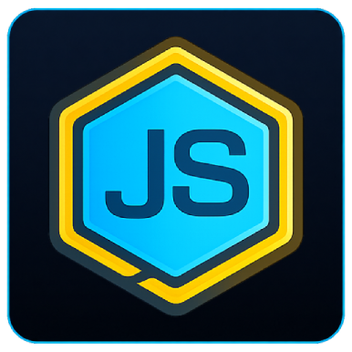

#  Node.js CI/CD Components

::include{file=.gitlab/badges.md}

Zestaw komponentów GitLab CI/CD do uruchamiania testów projektów Node.js.

## Komponenty

| Komponent | Zastosowanie | Domyślny job |
|---|---|---|
| [`playwright`](templates/playwright/template.yml) | Uruchamianie testów end-to-end Playwright | `playwright-e2e` |

Wszystkie komponenty są wersjonowane wspólnie. Dla stabilnych pipeline należy
używać pełnego taga SemVer, na przykład `1.0.0`.

## Szybki start

Komponent `playwright` korzysta z ukrytych jobów `.before_script` i
`.after_script` dostarczanych przez komponenty bootstrap:

```yaml
include:
  - component: $CI_SERVER_FQDN/dev.rachuna/pipelines/gitlab/components/bootstrap/_before_script@1.0.0
  - component: $CI_SERVER_FQDN/dev.rachuna/pipelines/gitlab/components/bootstrap/_after_script@1.0.0

  - component: $CI_SERVER_FQDN/dev.rachuna/pipelines/gitlab/components/nodejs/playwright@1.0.0
```

Job wykonuje `npm ci`, a następnie uruchamia testy poleceniem
`npx playwright test --reporter=list,junit`. Raport JUnit jest zapisywany w
`test-results/results.xml` niezależnie od katalogu, w którym znajdują się testy.

> [!warning]
> Komponent `_before_script` wymaga zmiennej `GITLAB_TOKEN`, używanej przez
> helper `glab` do uwierzytelnienia w GitLab.com. Token jest również wymagany,
> gdy testy Playwright są pobierane z zewnętrznego prywatnego repozytorium.

## Zewnętrzne repozytorium testów

Testy mogą znajdować się w innym repozytorium GitLab. Komponent sklonuje je do
katalogu `.playwright-external-repository` i uruchomi testy w tym katalogu:

```yaml
include:
  - component: $CI_SERVER_FQDN/dev.rachuna/pipelines/gitlab/components/bootstrap/_before_script@1.0.0
  - component: $CI_SERVER_FQDN/dev.rachuna/pipelines/gitlab/components/bootstrap/_after_script@1.0.0

  - component: $CI_SERVER_FQDN/dev.rachuna/pipelines/gitlab/components/nodejs/playwright@1.0.0
    inputs:
      job-external-repository-fullpath: dev.rachuna/example/playwright-tests
      job-external-repository-ref: main
      job-install-dependency: true
```

## Struktura repozytorium

```text
.
├── templates/
│   └── playwright/
│       └── template.yml
├── .gitlab-ci.yml
├── LICENSE
└── README.md
```

---

::include{file=.gitlab/footer.md}
